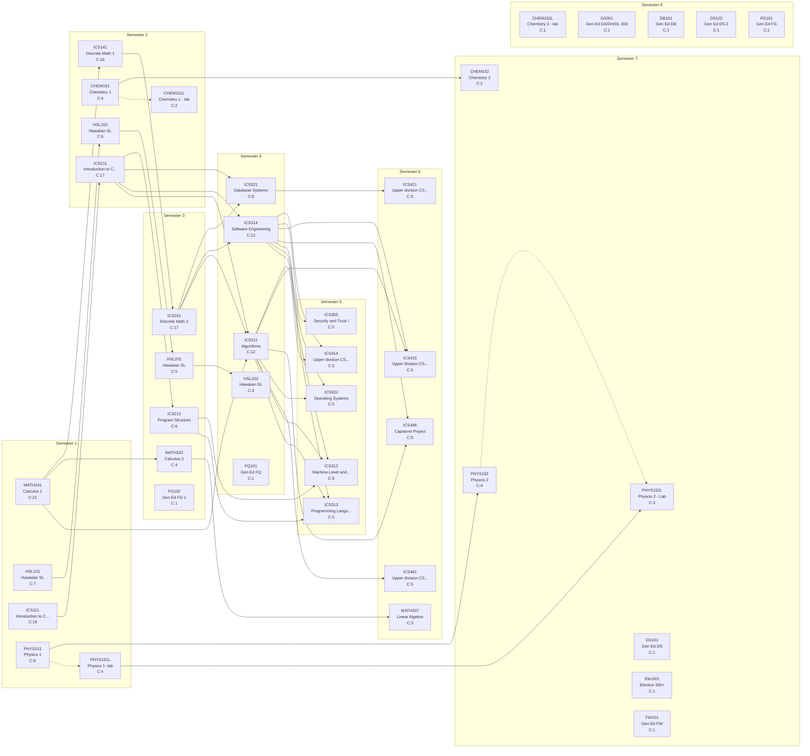

# Curriculum Report: Computer Science

## Overview

| Property | Value |
|----------|-------|
| **Institution** | University of Hawaii - Manoa |
| **Degree** | BS Computer Science |
| **System** | semester |
| **Years** | 4 |
| **CIP Code** | 11.0701 |
| **Total Credits** | 120.0 |
| **Total Courses** | 41 |

## Complexity Metrics Summary

| Metric | Value | Details |
|--------|-------|---------|
| **Total Structural Complexity** | 236 | Sum of all course complexities |
| **Longest Delay** | 5 | Course: ICS141 |
| **Highest Centrality** | 84 | Course: ICS311 |

### Longest Delay Path (Critical Path)

MATH241 → ICS141 → ICS241 → ICS314 → ICS415

---

## Term-by-Term Schedule

| Semester | Courses | Credits |
|---|---|---|
| 1 | MATH241 - Calculus 1, HSL101 - Hawaiian SL, ICS111 - Introduction to Computer Science I, PHYS151 - Physics 1, PHYS151L - Physics 1 -lab | 15.0 |
| 2 | CHEM161 - Chemistry 1, CHEM161L - Chemistry 1 - lab, ICS141 - Discrete Math 1, HSL102 - Hawaiian SL, ICS211 - Introduction to Computer Science 2 | 14.0 |
| 3 | ICS241 - Discrete Math 2, HSL201 - Hawaiian SL, ICS212 - Program Structure, MATH242 - Calculus 2, FG102 - Gen Ed FG 2 | 16.0 |
| 4 | ICS311 - Algorithms, ICS314 - Software Engineering, ICS321 - Database Systems, HSL202 - Hawaiian SL, FQ101 - Gen Ed FQ | 16.0 |
| 5 | ICS312 - Machine-Level and System Programming, ICS313 - Programming Language Theory, ICS332 - Operating Systems, ICS355 - Security and Trust I, ICS414 - Upper division CS elective | 15.0 |
| 6 | ICS415 - Upper division CS elective, ICS421 - Upper division CS elective, ICS461 - Upper division CS elective, ICS496 - Capstone Project, MATH307 - Linear Algebra | 15.0 |
| 7 | PHYS152 - Physcis 2, PHYS152L - Physcis 2 - Lab, CHEM162 - Chemistry 2, DS101 - Gen Ed DS, Elec301 - Elective 300+, FW101 - Gen Ed FW | 16.0 |
| 8 | CHEM162L - Chemistry 2 - lab, DA301 - Gen Ed DA/DH/DL 300, DB101 - Gen Ed DB, DS102 - Gen Ed DS 2, FG101 - Gen Ed FG | 13.0 |

---

## Course Metrics

| Course | Name | Credits | Complexity | Blocking | Delay | Centrality |
|---|---|---|---|---|---|---|
| MATH241 | Calculus 1 | 4.0 | 21 | 16 | 5 | 0 |
| ICS111 | Introduction to Computer Science I | 4.0 | 18 | 14 | 4 | 0 |
| ICS141 | Discrete Math 1 | 3.0 | 18 | 13 | 5 | 75 |
| ICS211 | Introduction to Computer Science 2 | 4.0 | 17 | 13 | 4 | 68 |
| ICS241 | Discrete Math 2 | 3.0 | 17 | 12 | 5 | 75 |
| ICS311 | Algorithms | 4.0 | 12 | 7 | 5 | 84 |
| ICS314 | Software Engineering | 3.0 | 12 | 7 | 5 | 63 |
| HSL101 | Hawaiian SL | 3.0 | 7 | 3 | 4 | 0 |
| ICS212 | Program Structure | 3.0 | 6 | 2 | 4 | 8 |
| ICS321 | Database Systems | 3.0 | 6 | 1 | 5 | 9 |
| PHYS151 | Physics 1 | 3.0 | 6 | 3 | 3 | 0 |
| HSL102 | Hawaiian SL | 3.0 | 6 | 2 | 4 | 4 |
| ICS332 | Operating Systems | 3.0 | 5 | 0 | 5 | 0 |
| ICS355 | Security and Trust I | 3.0 | 5 | 0 | 5 | 0 |
| ICS496 | Capstone Project | 3.0 | 5 | 0 | 5 | 0 |
| ICS312 | Machine-Level and System Programming | 3.0 | 5 | 0 | 5 | 0 |
| ICS313 | Programming Language Theory | 3.0 | 5 | 0 | 5 | 0 |
| ICS414 | Upper division CS elective | 3.0 | 5 | 0 | 5 | 0 |
| ICS415 | Upper division CS elective | 3.0 | 5 | 0 | 5 | 0 |
| ICS421 | Upper division CS elective | 3.0 | 5 | 0 | 5 | 0 |
| ICS461 | Upper division CS elective | 3.0 | 5 | 0 | 5 | 0 |
| HSL201 | Hawaiian SL | 3.0 | 5 | 1 | 4 | 4 |
| MATH242 | Calculus 2 | 4.0 | 4 | 1 | 3 | 3 |
| PHYS151L | Physics 1 -lab | 1.0 | 4 | 1 | 3 | 3 |
| PHYS152 | Physcis 2 | 3.0 | 4 | 1 | 3 | 3 |
| HSL202 | Hawaiian SL | 3.0 | 4 | 0 | 4 | 0 |
| CHEM161 | Chemistry 1 | 3.0 | 4 | 2 | 2 | 0 |
| MATH307 | Linear Algebra | 3.0 | 3 | 0 | 3 | 0 |
| PHYS152L | Physcis 2 - Lab | 1.0 | 3 | 0 | 3 | 0 |
| CHEM161L | Chemistry 1 - lab | 1.0 | 2 | 0 | 2 | 0 |
| CHEM162 | Chemistry 2 | 3.0 | 2 | 0 | 2 | 0 |
| CHEM162L | Chemistry 2 - lab | 1.0 | 1 | 0 | 1 | 0 |
| FG101 | Gen Ed FG | 3.0 | 1 | 0 | 1 | 0 |
| FW101 | Gen Ed FW | 3.0 | 1 | 0 | 1 | 0 |
| FG102 | Gen Ed FG 2 | 3.0 | 1 | 0 | 1 | 0 |
| DS101 | Gen Ed DS | 3.0 | 1 | 0 | 1 | 0 |
| DS102 | Gen Ed DS 2 | 3.0 | 1 | 0 | 1 | 0 |
| DB101 | Gen Ed DB | 3.0 | 1 | 0 | 1 | 0 |
| DA301 | Gen Ed DA/DH/DL 300 | 3.0 | 1 | 0 | 1 | 0 |
| Elec301 | Elective 300+ | 3.0 | 1 | 0 | 1 | 0 |
| FQ101 | Gen Ed FQ | 3.0 | 1 | 0 | 1 | 0 |

---

## Curriculum Graph

The following diagram shows the prerequisite relationships between courses.
- **Solid arrows** (→) indicate prerequisites
- **Dashed arrows** (⤍) indicate corequisites
- **C:N** indicates the complexity score

---

*Generated by NuAnalytics*
