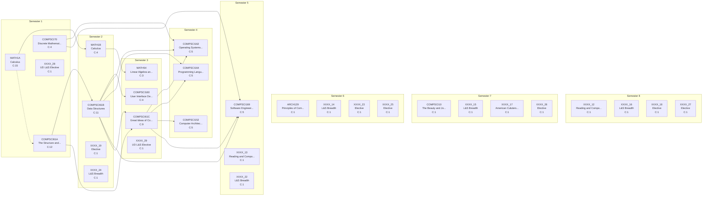

# Curriculum Report: Computer Science

## Overview

| Property | Value |
|----------|-------|
| **Institution** | California Berkeley |
| **Degree** | BA Computer Science |
| **System** | semester |
| **Years** | 4 |
| **CIP Code** | 11.07 |
| **Total Credits** | 113.0 |
| **Total Courses** | 30 |

## Complexity Metrics Summary

| Metric | Value | Details |
|--------|-------|---------|
| **Total Structural Complexity** | 100 | Sum of all course complexities |
| **Longest Delay** | 5 | Course: COMPSCI61A |
| **Highest Centrality** | 52 | Course: COMPSCI61A |

### Longest Delay Path (Critical Path)

(COMPSCI61A+MATH1A) → COMPSCI61B → COMPSCI61C → COMPSCI152

---

## Term-by-Term Schedule

| Semester | Courses | Credits |
|---|---|---|
| 1 | COMPSCI61A - The Structure and Interpretation of Computer Programs, MATH1A - Calculus, COMPSCI70 - Discrete Mathematics and Probaility Theory, XXXX_28 - UD L&S Elective | 16.0 |
| 2 | COMPSCI61B - Data Structures, MATH1B - Calculus, XXXX_19 - Elective, XXXX_24 - L&S Breadth | 15.0 |
| 3 | COMPSCI61C - Great Ideas of Computer Architecture, COMPSCI160 - User Interface Design and Development (Upper Division CS Elective), MATH54 - Linear Algebra and Differntial Equations, XXXX_29 - UD L&S Elective | 15.0 |
| 4 | COMPSCI152 - Computer Architecture and Engineering (Upper Division CS Elective), COMPSCI162 - Operating Systems and System Programming (Upper Division CS Elective), COMPSCI164 - Programming Languages and Compilers (Upper Division CS Elective) | 12.0 |
| 5 | COMPSCI169 - Software Engineering (Upper Division CS Elective), XXXX_13 - Reading and Composition B, XXXX_22 - L&S Breadth | 12.0 |
| 6 | ARCH129 - Principles of Computer Aided Architectural Design (Non CS Technical Elective), XXXX_14 - L&S Breadth, XXXX_23 - Elective, XXXX_25 - Elective | 14.0 |
| 7 | COMPSCI10 - The Beauty and Joy of Computing, XXXX_15 - L&S Breadth, XXXX_17 - American Culuters Req, XXXX_26 - Elective | 14.0 |
| 8 | XXXX_12 - Reading and Composition A, XXXX_16 - L&S Breadth, XXXX_18 - Elective, XXXX_27 - Elective | 15.0 |

---

## Course Metrics

| Course | Name | Credits | Complexity | Blocking | Delay | Centrality |
|---|---|---|---|---|---|---|
| MATH1A | Calculus | 4.0 | 15 | 10 | 5 | 0 |
| COMPSCI61A | The Structure and Interpretation of Computer Programs | 4.0 | 12 | 7 | 5 | 52 |
| COMPSCI61B | Data Structures | 4.0 | 11 | 6 | 5 | 36 |
| COMPSCI61C | Great Ideas of Computer Architecture | 4.0 | 9 | 4 | 5 | 36 |
| COMPSCI169 | Software Engineering (Upper Division CS Elective) | 4.0 | 5 | 0 | 5 | 0 |
| COMPSCI164 | Programming Languages and Compilers (Upper Division CS Elective) | 4.0 | 5 | 0 | 5 | 0 |
| COMPSCI152 | Computer Architecture and Engineering (Upper Division CS Elective) | 4.0 | 5 | 0 | 5 | 0 |
| COMPSCI162 | Operating Systems and System Programming (Upper Division CS Elective) | 4.0 | 5 | 0 | 5 | 0 |
| COMPSCI70 | Discrete Mathematics and Probaility Theory | 4.0 | 4 | 2 | 2 | 0 |
| MATH1B | Calculus | 4.0 | 4 | 1 | 3 | 3 |
| COMPSCI160 | User Interface Design and Development (Upper Division CS Elective) | 4.0 | 4 | 0 | 4 | 0 |
| MATH54 | Linear Algebra and Differntial Equations | 4.0 | 3 | 0 | 3 | 0 |
| ARCH129 | Principles of Computer Aided Architectural Design (Non CS Technical Elective) | 4.0 | 1 | 0 | 1 | 0 |
| XXXX_12 | Reading and Composition A | 4.0 | 1 | 0 | 1 | 0 |
| XXXX_13 | Reading and Composition B | 4.0 | 1 | 0 | 1 | 0 |
| XXXX_14 | L&S Breadth | 4.0 | 1 | 0 | 1 | 0 |
| XXXX_15 | L&S Breadth | 3.0 | 1 | 0 | 1 | 0 |
| XXXX_16 | L&S Breadth | 3.0 | 1 | 0 | 1 | 0 |
| XXXX_17 | American Culuters Req | 4.0 | 1 | 0 | 1 | 0 |
| XXXX_18 | Elective | 4.0 | 1 | 0 | 1 | 0 |
| XXXX_19 | Elective | 3.0 | 1 | 0 | 1 | 0 |
| XXXX_22 | L&S Breadth | 4.0 | 1 | 0 | 1 | 0 |
| XXXX_23 | Elective | 3.0 | 1 | 0 | 1 | 0 |
| XXXX_24 | L&S Breadth | 4.0 | 1 | 0 | 1 | 0 |
| XXXX_25 | Elective | 3.0 | 1 | 0 | 1 | 0 |
| XXXX_26 | Elective | 3.0 | 1 | 0 | 1 | 0 |
| XXXX_27 | Elective | 4.0 | 1 | 0 | 1 | 0 |
| XXXX_28 | UD L&S Elective | 4.0 | 1 | 0 | 1 | 0 |
| XXXX_29 | UD L&S Elective | 3.0 | 1 | 0 | 1 | 0 |
| COMPSCI10 | The Beauty and Joy of Computing | 4.0 | 1 | 0 | 1 | 0 |

---

## Curriculum Graph

The following diagram shows the prerequisite relationships between courses.
- **Solid arrows** (→) indicate prerequisites
- **Dashed arrows** (⤍) indicate corequisites
- **C:N** indicates the complexity score

---

*Generated by NuAnalytics*
