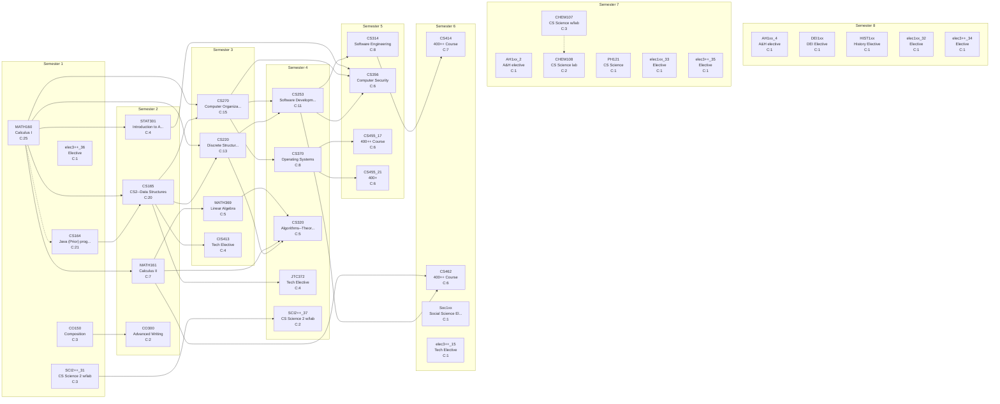

# Curriculum Report: Colostate_CS_2017

## Overview

| Property | Value |
|----------|-------|
| **Institution** | Colorado State University |
| **Degree** | BS Colostate_CS_2017 |
| **System** | semester |
| **Years** | 4 |
| **CIP Code** | 11.0701 |
| **Total Credits** | 120.0 |
| **Total Courses** | 37 |

## Complexity Metrics Summary

| Metric | Value | Details |
|--------|-------|---------|
| **Total Structural Complexity** | 208 | Sum of all course complexities |
| **Longest Delay** | 7 | Course: MATH160 |
| **Highest Centrality** | 124 | Course: CS165 |

### Longest Delay Path (Critical Path)

MATH160 → CS270 → CS253 → CS314 → CS414

---

## Term-by-Term Schedule

| Semester | Courses | Credits |
|---|---|---|
| 1 | CS164 - Java (Prior) programming experience, MATH160 - Calculus I, CO150 - Composition, SCI2++_31 - CS Science 2 w/lab, elec3++_36 - Elective | 17.0 |
| 2 | CS165 - CS2--Data Structures, MATH161 - Calculus II, STAT301 - Introduction to Applied Statistical Methods, CO300 - Advanced Writing | 15.0 |
| 3 | CS220 - Discrete Structures and their Applications, CS270 - Computer Organization, MATH369 - Linear Algebra, CIS413 - Tech Elective | 14.0 |
| 4 | CS253 - Software Development with C++, CS370 - Operating Systems, CS320 - Algorithms--Theory and Practice, JTC372 - Tech Elective, SCI2++_37 - CS Science 2 w/lab | 15.0 |
| 5 | CS314 - Software Engineering, CS356 - Computer Security, CS455_17 - 400++ Course, CS455_21 - 400+ | 14.0 |
| 6 | CS414 - 400++ Course, CS462 - 400++ Course, Soc1xx - Social Science Elective, elec3++_15 - Tech Elective | 14.0 |
| 7 | AH1xx_2 - A&H elective, CHEM107 - CS Science w/lab, CHEM108 - CS Science lab, PH121 - CS Science, elec1xx_33 - Elective, elec3++_35 - Elective | 16.0 |
| 8 | AH1xx_4 - A&H elective, DEI1xx - DEI Elective, HIST1xx - History Elective, elec1xx_32 - Elective, elec3++_34 - Elective | 15.0 |

---

## Course Metrics

| Course | Name | Credits | Complexity | Blocking | Delay | Centrality |
|---|---|---|---|---|---|---|
| MATH160 | Calculus I | 4.0 | 25 | 18 | 7 | 0 |
| CS164 | Java (Prior) programming experience | 4.0 | 21 | 14 | 7 | 68 |
| CS165 | CS2--Data Structures | 4.0 | 20 | 13 | 7 | 124 |
| CS270 | Computer Organization | 4.0 | 15 | 8 | 7 | 90 |
| CS220 | Discrete Structures and their Applications | 4.0 | 13 | 6 | 7 | 60 |
| CS253 | Software Development with C++ | 4.0 | 11 | 4 | 7 | 96 |
| CS314 | Software Engineering | 3.0 | 8 | 1 | 7 | 36 |
| CS370 | Operating Systems | 3.0 | 8 | 2 | 6 | 30 |
| MATH161 | Calculus II | 4.0 | 7 | 3 | 4 | 10 |
| CS414 | 400++ Course | 4.0 | 7 | 0 | 7 | 0 |
| CS356 | Computer Security | 3.0 | 6 | 0 | 6 | 0 |
| CS455_17 | 400++ Course | 4.0 | 6 | 0 | 6 | 0 |
| CS462 | 400++ Course | 4.0 | 6 | 0 | 6 | 0 |
| CS455_21 | 400+ | 4.0 | 6 | 0 | 6 | 0 |
| CS320 | Algorithms--Theory and Practice | 3.0 | 5 | 0 | 5 | 0 |
| MATH369 | Linear Algebra | 3.0 | 5 | 1 | 4 | 4 |
| STAT301 | Introduction to Applied Statistical Methods | 4.0 | 4 | 1 | 3 | 3 |
| JTC372 | Tech Elective | 3.0 | 4 | 0 | 4 | 0 |
| CIS413 | Tech Elective | 3.0 | 4 | 0 | 4 | 0 |
| CO150 | Composition | 3.0 | 3 | 1 | 2 | 0 |
| CHEM107 | CS Science w/lab | 3.0 | 3 | 1 | 2 | 0 |
| SCI2++_31 | CS Science 2 w/lab | 3.0 | 3 | 1 | 2 | 0 |
| CO300 | Advanced Writing | 3.0 | 2 | 0 | 2 | 0 |
| CHEM108 | CS Science lab | 1.0 | 2 | 0 | 2 | 0 |
| SCI2++_37 | CS Science 2 w/lab | 2.0 | 2 | 0 | 2 | 0 |
| AH1xx_2 | A&H elective | 3.0 | 1 | 0 | 1 | 0 |
| AH1xx_4 | A&H elective | 3.0 | 1 | 0 | 1 | 0 |
| elec3++_15 | Tech Elective | 3.0 | 1 | 0 | 1 | 0 |
| PH121 | CS Science | 3.0 | 1 | 0 | 1 | 0 |
| DEI1xx | DEI Elective | 3.0 | 1 | 0 | 1 | 0 |
| HIST1xx | History Elective | 3.0 | 1 | 0 | 1 | 0 |
| Soc1xx | Social Science Elective | 3.0 | 1 | 0 | 1 | 0 |
| elec1xx_32 | Elective | 3.0 | 1 | 0 | 1 | 0 |
| elec1xx_33 | Elective | 3.0 | 1 | 0 | 1 | 0 |
| elec3++_34 | Elective | 3.0 | 1 | 0 | 1 | 0 |
| elec3++_35 | Elective | 3.0 | 1 | 0 | 1 | 0 |
| elec3++_36 | Elective | 3.0 | 1 | 0 | 1 | 0 |

---

## Curriculum Graph

The following diagram shows the prerequisite relationships between courses.
- **Solid arrows** (→) indicate prerequisites
- **Dashed arrows** (⤍) indicate corequisites
- **C:N** indicates the complexity score

---

*Generated by NuAnalytics*
