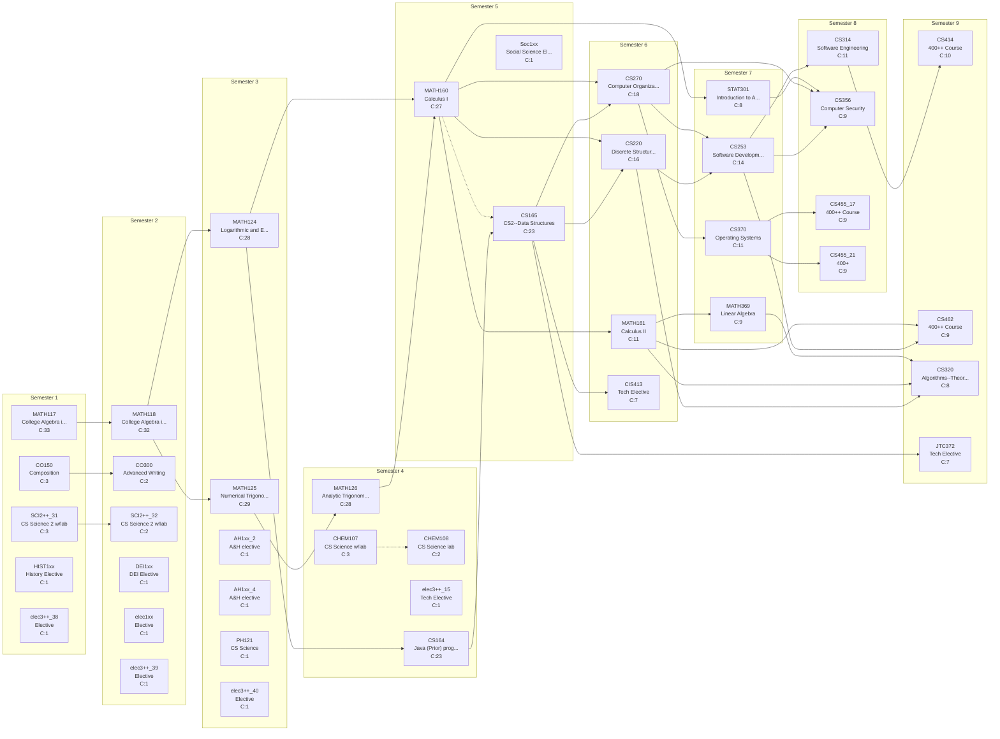

# Curriculum Report: Colostate_CS_2017_w_MATH

## Overview

| Property | Value |
|----------|-------|
| **Institution** | Colorado State University |
| **Degree** | BS Colostate_CS_2017_w_MATH |
| **System** | semester |
| **Years** | 5 |
| **CIP Code** | 11.0701 |
| **Total Credits** | 120.0 |
| **Total Courses** | 41 |

## Complexity Metrics Summary

| Metric | Value | Details |
|--------|-------|---------|
| **Total Structural Complexity** | 415 | Sum of all course complexities |
| **Longest Delay** | 10 | Course: MATH160 |
| **Highest Centrality** | 492 | Course: MATH118 |

### Longest Delay Path (Critical Path)

MATH117 → MATH118 → MATH125 → MATH126 → MATH160 → CS270 → CS253 → CS314 → CS414

---

## Term-by-Term Schedule

| Semester | Courses | Credits |
|---|---|---|
| 1 | MATH117 - College Algebra in Context I, CO150 - Composition, SCI2++_31 - CS Science 2 w/lab, HIST1xx - History Elective, elec3++_38 - Elective | 13.0 |
| 2 | MATH118 - College Algebra in Context II, CO300 - Advanced Writing, SCI2++_32 - CS Science 2 w/lab, DEI1xx - DEI Elective, elec1xx - Elective, elec3++_39 - Elective | 13.0 |
| 3 | MATH125 - Numerical Trigonometry, MATH124 - Logarithmic and Exponential Functions, AH1xx_2 - A&H elective, AH1xx_4 - A&H elective, PH121 - CS Science, elec3++_40 - Elective | 14.0 |
| 4 | MATH126 - Analytic Trigonometry, CS164 - Java (Prior) programming experience, CHEM107 - CS Science w/lab, CHEM108 - CS Science lab, elec3++_15 - Tech Elective | 12.0 |
| 5 | CS165 - CS2--Data Structures, MATH160 - Calculus I, Soc1xx - Social Science Elective | 11.0 |
| 6 | CS220 - Discrete Structures and their Applications, CS270 - Computer Organization, MATH161 - Calculus II, CIS413 - Tech Elective | 15.0 |
| 7 | CS253 - Software Development with C++, CS370 - Operating Systems, MATH369 - Linear Algebra, STAT301 - Introduction to Applied Statistical Methods | 14.0 |
| 8 | CS314 - Software Engineering, CS356 - Computer Security, CS455_17 - 400++ Course, CS455_21 - 400+ | 14.0 |
| 9 | CS414 - 400++ Course, CS462 - 400++ Course, CS320 - Algorithms--Theory and Practice, JTC372 - Tech Elective | 14.0 |

---

## Course Metrics

| Course | Name | Credits | Complexity | Blocking | Delay | Centrality |
|---|---|---|---|---|---|---|
| MATH117 | College Algebra in Context I | 1.0 | 33 | 23 | 10 | 0 |
| MATH118 | College Algebra in Context II | 1.0 | 32 | 22 | 10 | 492 |
| MATH125 | Numerical Trigonometry | 1.0 | 29 | 19 | 10 | 213 |
| MATH124 | Logarithmic and Exponential Functions | 1.0 | 28 | 19 | 9 | 279 |
| MATH126 | Analytic Trigonometry | 1.0 | 28 | 18 | 10 | 213 |
| MATH160 | Calculus I | 4.0 | 27 | 17 | 10 | 400 |
| CS164 | Java (Prior) programming experience | 4.0 | 23 | 14 | 9 | 92 |
| CS165 | CS2--Data Structures | 4.0 | 23 | 13 | 10 | 288 |
| CS270 | Computer Organization | 4.0 | 18 | 8 | 10 | 240 |
| CS220 | Discrete Structures and their Applications | 4.0 | 16 | 6 | 10 | 160 |
| CS253 | Software Development with C++ | 4.0 | 14 | 4 | 10 | 250 |
| MATH161 | Calculus II | 4.0 | 11 | 3 | 8 | 41 |
| CS314 | Software Engineering | 3.0 | 11 | 1 | 10 | 90 |
| CS370 | Operating Systems | 3.0 | 11 | 2 | 9 | 80 |
| CS414 | 400++ Course | 4.0 | 10 | 0 | 10 | 0 |
| CS356 | Computer Security | 3.0 | 9 | 0 | 9 | 0 |
| CS455_17 | 400++ Course | 4.0 | 9 | 0 | 9 | 0 |
| CS462 | 400++ Course | 4.0 | 9 | 0 | 9 | 0 |
| CS455_21 | 400+ | 4.0 | 9 | 0 | 9 | 0 |
| MATH369 | Linear Algebra | 3.0 | 9 | 1 | 8 | 15 |
| STAT301 | Introduction to Applied Statistical Methods | 4.0 | 8 | 1 | 7 | 13 |
| CS320 | Algorithms--Theory and Practice | 3.0 | 8 | 0 | 8 | 0 |
| JTC372 | Tech Elective | 3.0 | 7 | 0 | 7 | 0 |
| CIS413 | Tech Elective | 3.0 | 7 | 0 | 7 | 0 |
| CO150 | Composition | 3.0 | 3 | 1 | 2 | 0 |
| CHEM107 | CS Science w/lab | 3.0 | 3 | 1 | 2 | 0 |
| SCI2++_31 | CS Science 2 w/lab | 3.0 | 3 | 1 | 2 | 0 |
| CO300 | Advanced Writing | 3.0 | 2 | 0 | 2 | 0 |
| CHEM108 | CS Science lab | 1.0 | 2 | 0 | 2 | 0 |
| SCI2++_32 | CS Science 2 w/lab | 2.0 | 2 | 0 | 2 | 0 |
| AH1xx_2 | A&H elective | 3.0 | 1 | 0 | 1 | 0 |
| AH1xx_4 | A&H elective | 3.0 | 1 | 0 | 1 | 0 |
| elec3++_15 | Tech Elective | 3.0 | 1 | 0 | 1 | 0 |
| PH121 | CS Science | 3.0 | 1 | 0 | 1 | 0 |
| DEI1xx | DEI Elective | 3.0 | 1 | 0 | 1 | 0 |
| HIST1xx | History Elective | 3.0 | 1 | 0 | 1 | 0 |
| Soc1xx | Social Science Elective | 3.0 | 1 | 0 | 1 | 0 |
| elec3++_38 | Elective | 3.0 | 1 | 0 | 1 | 0 |
| elec3++_39 | Elective | 3.0 | 1 | 0 | 1 | 0 |
| elec3++_40 | Elective | 3.0 | 1 | 0 | 1 | 0 |
| elec1xx | Elective | 1.0 | 1 | 0 | 1 | 0 |

---

## Curriculum Graph

The following diagram shows the prerequisite relationships between courses.
- **Solid arrows** (→) indicate prerequisites
- **Dashed arrows** (⤍) indicate corequisites
- **C:N** indicates the complexity score

---

*Generated by NuAnalytics*
