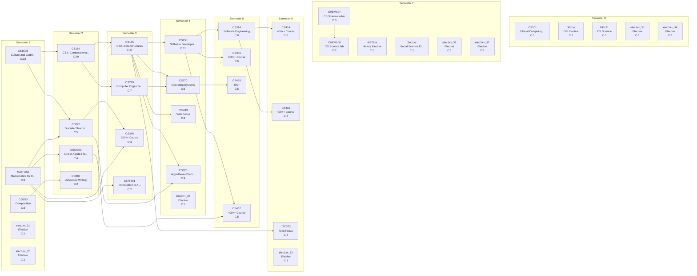

# Curriculum Report: Colostate_CS Degree

## Overview

| Property | Value |
|----------|-------|
| **Institution** | Colorado State University |
| **Degree** | BS Colostate_CS Degree |
| **System** | semester |
| **Years** | 4 |
| **CIP Code** | 11.0701 |
| **Total Credits** | 120.0 |
| **Total Courses** | 37 |

## Complexity Metrics Summary

| Metric | Value | Details |
|--------|-------|---------|
| **Total Structural Complexity** | 175 | Sum of all course complexities |
| **Longest Delay** | 6 | Course: CS150B |
| **Highest Centrality** | 44 | Course: CS164 |

### Longest Delay Path (Critical Path)

CS150B → CS164 → CS165 → CS253 → CS314 → CS414

---

## Term-by-Term Schedule

| Semester | Courses | Credits |
|---|---|---|
| 1 | CS150B - Culture and Coding: Python (GT-AH3), MATH156 - Mathematics for Computational Science I, CO150 - Composition, elec1xx_31 - Elective, elec3++_35 - Elective | 16.0 |
| 2 | CS164 - CS1--Computational Thinking with Java, CS220 - Discrete Structures and their Applications, DSCI369 - Linear Algebra for Data Science, CO300 - Advanced Writing | 15.0 |
| 3 | CS165 - CS2--Data Structures, CS270 - Computer Organization, CS345 - 300++ Course, STAT301 - Introduction to Applied Statistical Methods | 15.0 |
| 4 | CS253 - Software Development with C++, CS370 - Operating Systems, CIS413 - Tech Focus, CS320 - Algorithms--Theory and Practice, elec3++_36 - Elective | 16.0 |
| 5 | CS314 - Software Engineering, CS356 - 300++ Course, CS455 - 400+, CS462 - 400++ Course | 14.0 |
| 6 | CS414 - 400++ Course, CS415 - 400++ Course, JTC372 - Tech Focus, elec1xx_33 - Elective | 14.0 |
| 7 | CHEM107 - CS Science w/lab, CHEM108 - CS Science lab, HIST1xx - History Elective, Soc1xx - Social Science Elective, elec1xx_32 - Elective, elec3++_37 - Elective | 15.0 |
| 8 | CS201 - Ethical Computing Systems (GT-AH3), DEI1xx - DEI Elective, PH121 - CS Science, elec1xx_30 - Elective, elec3++_34 - Elective | 15.0 |

---

## Course Metrics

| Course | Name | Credits | Complexity | Blocking | Delay | Centrality |
|---|---|---|---|---|---|---|
| CS150B | Culture and Coding: Python (GT-AH3) | 3.0 | 22 | 16 | 6 | 0 |
| CS164 | CS1--Computational Thinking with Java | 4.0 | 19 | 13 | 6 | 44 |
| CS165 | CS2--Data Structures | 4.0 | 17 | 11 | 6 | 39 |
| CS253 | Software Development with C++ | 4.0 | 11 | 5 | 6 | 22 |
| MATH156 | Mathematics for Computational Science I | 4.0 | 9 | 6 | 3 | 0 |
| CS314 | Software Engineering | 3.0 | 8 | 2 | 6 | 12 |
| CS270 | Computer Organization | 4.0 | 7 | 2 | 5 | 5 |
| CS370 | Operating Systems | 3.0 | 6 | 1 | 5 | 10 |
| CS414 | 400++ Course | 4.0 | 6 | 0 | 6 | 0 |
| CS415 | 400++ Course | 4.0 | 6 | 0 | 6 | 0 |
| CS220 | Discrete Structures and their Applications | 4.0 | 5 | 2 | 3 | 12 |
| CS356 | 300++ Course | 3.0 | 5 | 0 | 5 | 0 |
| CS462 | 400++ Course | 4.0 | 5 | 0 | 5 | 0 |
| CS455 | 400+ | 4.0 | 5 | 0 | 5 | 0 |
| DSCI369 | Linear Algebra for Data Science | 4.0 | 4 | 1 | 3 | 3 |
| CS320 | Algorithms--Theory and Practice | 3.0 | 4 | 0 | 4 | 0 |
| JTC372 | Tech Focus | 3.0 | 4 | 0 | 4 | 0 |
| CIS413 | Tech Focus | 3.0 | 4 | 0 | 4 | 0 |
| CS345 | 300++ Course | 3.0 | 3 | 0 | 3 | 0 |
| CO150 | Composition | 3.0 | 3 | 1 | 2 | 0 |
| CHEM107 | CS Science w/lab | 3.0 | 3 | 1 | 2 | 0 |
| STAT301 | Introduction to Applied Statistical Methods | 4.0 | 2 | 0 | 2 | 0 |
| CO300 | Advanced Writing | 3.0 | 2 | 0 | 2 | 0 |
| CHEM108 | CS Science lab | 1.0 | 2 | 0 | 2 | 0 |
| CS201 | Ethical Computing Systems (GT-AH3) | 3.0 | 1 | 0 | 1 | 0 |
| PH121 | CS Science | 3.0 | 1 | 0 | 1 | 0 |
| DEI1xx | DEI Elective | 3.0 | 1 | 0 | 1 | 0 |
| HIST1xx | History Elective | 3.0 | 1 | 0 | 1 | 0 |
| Soc1xx | Social Science Elective | 3.0 | 1 | 0 | 1 | 0 |
| elec1xx_30 | Elective | 3.0 | 1 | 0 | 1 | 0 |
| elec1xx_31 | Elective | 3.0 | 1 | 0 | 1 | 0 |
| elec1xx_32 | Elective | 3.0 | 1 | 0 | 1 | 0 |
| elec1xx_33 | Elective | 3.0 | 1 | 0 | 1 | 0 |
| elec3++_34 | Elective | 3.0 | 1 | 0 | 1 | 0 |
| elec3++_35 | Elective | 3.0 | 1 | 0 | 1 | 0 |
| elec3++_36 | Elective | 3.0 | 1 | 0 | 1 | 0 |
| elec3++_37 | Elective | 2.0 | 1 | 0 | 1 | 0 |

---

## Curriculum Graph

The following diagram shows the prerequisite relationships between courses.
- **Solid arrows** (→) indicate prerequisites
- **Dashed arrows** (⤍) indicate corequisites
- **C:N** indicates the complexity score

---

*Generated by NuAnalytics*
