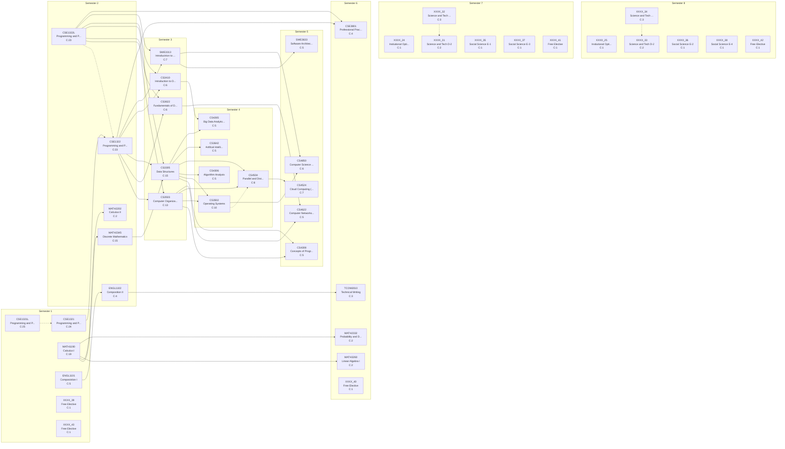

# Curriculum Report: Computer Science

## Overview

| Property | Value |
|----------|-------|
| **Institution** | Kennesaw State University |
| **Degree** | BS Computer Science |
| **System** | semster |
| **Years** | 4 |
| **CIP Code** | 11.07 |
| **Total Credits** | 120.0 |
| **Total Courses** | 43 |

## Complexity Metrics Summary

| Metric | Value | Details |
|--------|-------|---------|
| **Total Structural Complexity** | 280 | Sum of all course complexities |
| **Longest Delay** | 7 | Course: CSE1321 |
| **Highest Centrality** | 167 | Course: CSE1322 |

### Longest Delay Path (Critical Path)

(CSE1321+CSE1321L) → (CSE1322+CSE1322L) → CS3503 → (CS4504+CS3502) → CS4524

---

## Term-by-Term Schedule

| Semester | Courses | Credits |
|---|---|---|
| 1 | CSE1321 - Programming and Problem Solving I, CSE1321L - Programming and Problem Solving I Lab, MATH1190 - Calculus I, ENGL1101 - Composistion I, XXXX_39 - Free Elective, XXXX_43 - Free Elective | 16.0 |
| 2 | CSE1322 - Programming and Problem Solving II, CSE1322L - Programming and Problem Solving II Lab, MATH2345 - Discrete Mathematics, ENGL1102 - Composition II, MATH2202 - Calculus II | 14.0 |
| 3 | CS3503 - Computer Organization and Architecture, CS3305 - Data Structures, CS3410 - Introduction to Databse Systems, CS3622 - Fundamentals of Data Communication, SWE3313 - Introductrion to Software Engineering | 15.0 |
| 4 | CS3502 - Operating Systems, CS4504 - Parallel and Distrubted Computing, CS3642 - Artifical Intelligence (CS Elective), CS4265 - Big Data Analytics (CS Elective), CS4306 - Algorithm Analysis | 15.0 |
| 5 | CS4524 - Cloud Computing (CS Elective), CS4850 - Computer Science Senior Project, CS4308 - Concepts of Programming Languages, CS4622 - Computer Networks (CS Elective), SWE3633 - Software Architecture and Design (CS Elective) | 15.0 |
| 6 | CSE3801 - Professional Practices and Ethics, TCOM2010 - Technical Writing, MATH2332 - Probability and Data Analysis, MATH3260 - Linear Algebra I, XXXX_40 - Free Elective | 14.0 |
| 7 | XXXX_24 - Instiutional Options B-1, XXXX_31 - Science and Tech D-2, XXXX_32 - Science and Tech D-2 Lab, XXXX_35 - Social Science E-1, XXXX_37 - Social Science E-3, XXXX_41 - Free Elective | 15.0 |
| 8 | XXXX_25 - Instiutional Options B-2, XXXX_33 - Science and Tech D-2, XXXX_34 - Science and Tech D-2 Lab, XXXX_36 - Social Science E-2, XXXX_38 - Social Science E-4, XXXX_42 - Free Elective | 16.0 |

---

## Course Metrics

| Course | Name | Credits | Complexity | Blocking | Delay | Centrality |
|---|---|---|---|---|---|---|
| CSE1321L | Programming and Problem Solving I Lab | 1.0 | 25 | 18 | 7 | 0 |
| CSE1321 | Programming and Problem Solving I | 3.0 | 24 | 17 | 7 | 92 |
| CSE1322 | Programming and Problem Solving II | 3.0 | 23 | 16 | 7 | 167 |
| CSE1322L | Programming and Problem Solving II Lab | 1.0 | 23 | 17 | 6 | 0 |
| MATH1190 | Calculus I | 4.0 | 19 | 13 | 6 | 0 |
| MATH2345 | Discrete Mathematics | 3.0 | 15 | 9 | 6 | 32 |
| CS3305 | Data Structures | 3.0 | 15 | 8 | 7 | 128 |
| CS3503 | Computer Organization and Architecture | 3.0 | 13 | 6 | 7 | 72 |
| CS3502 | Operating Systems | 3.0 | 10 | 3 | 7 | 77 |
| CS4504 | Parallel and Distrubted Computing | 3.0 | 8 | 1 | 7 | 77 |
| SWE3313 | Introductrion to Software Engineering | 3.0 | 7 | 2 | 5 | 24 |
| CS4524 | Cloud Computing (CS Elective) | 3.0 | 7 | 0 | 7 | 0 |
| CS3410 | Introduction to Databse Systems | 3.0 | 6 | 1 | 5 | 12 |
| CS3622 | Fundamentals of Data Communication | 3.0 | 6 | 1 | 5 | 12 |
| CS4850 | Computer Science Senior Project | 3.0 | 6 | 0 | 6 | 0 |
| ENGL1101 | Composistion I | 3.0 | 5 | 2 | 3 | 0 |
| CS4306 | Algorithm Analysis | 3.0 | 5 | 0 | 5 | 0 |
| CS4308 | Concepts of Programming Languages | 3.0 | 5 | 0 | 5 | 0 |
| CS4265 | Big Data Analytics (CS Elective) | 3.0 | 5 | 0 | 5 | 0 |
| CS4622 | Computer Networks (CS Elective) | 3.0 | 5 | 0 | 5 | 0 |
| CS3642 | Artifical Intelligence (CS Elective) | 3.0 | 5 | 0 | 5 | 0 |
| SWE3633 | Software Architecture and Design (CS Elective) | 3.0 | 5 | 0 | 5 | 0 |
| ENGL1102 | Composition II | 3.0 | 4 | 1 | 3 | 3 |
| CSE3801 | Professional Practices and Ethics | 2.0 | 4 | 0 | 4 | 0 |
| TCOM2010 | Technical Writing | 3.0 | 3 | 0 | 3 | 0 |
| XXXX_32 | Science and Tech D-2 Lab | 1.0 | 3 | 1 | 2 | 0 |
| XXXX_34 | Science and Tech D-2 Lab | 1.0 | 3 | 1 | 2 | 0 |
| MATH2202 | Calculus II | 4.0 | 2 | 0 | 2 | 0 |
| MATH2332 | Probability and Data Analysis | 3.0 | 2 | 0 | 2 | 0 |
| MATH3260 | Linear Algebra I | 3.0 | 2 | 0 | 2 | 0 |
| XXXX_31 | Science and Tech D-2 | 3.0 | 2 | 0 | 2 | 0 |
| XXXX_33 | Science and Tech D-2 | 3.0 | 2 | 0 | 2 | 0 |
| XXXX_24 | Instiutional Options B-1 | 2.0 | 1 | 0 | 1 | 0 |
| XXXX_25 | Instiutional Options B-2 | 3.0 | 1 | 0 | 1 | 0 |
| XXXX_35 | Social Science E-1 | 3.0 | 1 | 0 | 1 | 0 |
| XXXX_36 | Social Science E-2 | 3.0 | 1 | 0 | 1 | 0 |
| XXXX_37 | Social Science E-3 | 3.0 | 1 | 0 | 1 | 0 |
| XXXX_38 | Social Science E-4 | 3.0 | 1 | 0 | 1 | 0 |
| XXXX_39 | Free Elective | 3.0 | 1 | 0 | 1 | 0 |
| XXXX_40 | Free Elective | 3.0 | 1 | 0 | 1 | 0 |
| XXXX_41 | Free Elective | 3.0 | 1 | 0 | 1 | 0 |
| XXXX_42 | Free Elective | 3.0 | 1 | 0 | 1 | 0 |
| XXXX_43 | Free Elective | 2.0 | 1 | 0 | 1 | 0 |

---

## Curriculum Graph

The following diagram shows the prerequisite relationships between courses.
- **Solid arrows** (→) indicate prerequisites
- **Dashed arrows** (⤍) indicate corequisites
- **C:N** indicates the complexity score

---

*Generated by NuAnalytics*
