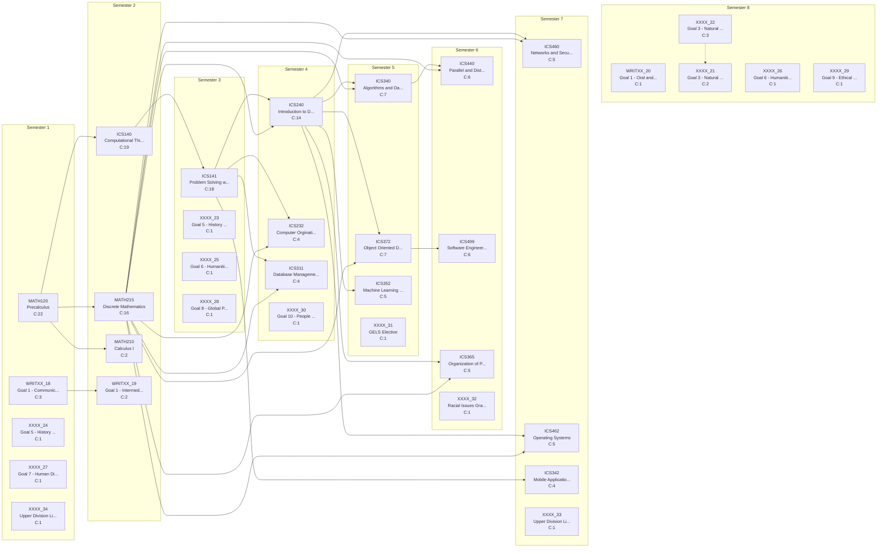

# Curriculum Report: Computer Science

## Overview

| Property | Value |
|----------|-------|
| **Institution** | Metro State University |
| **Degree** | BS Computer Science |
| **System** | semster |
| **Years** | 4 |
| **CIP Code** | 11.07 |
| **Total Credits** | 120.0 |
| **Total Courses** | 34 |

## Complexity Metrics Summary

| Metric | Value | Details |
|--------|-------|---------|
| **Total Structural Complexity** | 172 | Sum of all course complexities |
| **Longest Delay** | 6 | Course: ICS140 |
| **Highest Centrality** | 58 | Course: ICS240 |

### Longest Delay Path (Critical Path)

MATH120 → ICS140 → ICS141 → ICS240 → ICS340 → ICS440

---

## Term-by-Term Schedule

| Semester | Courses | Credits |
|---|---|---|
| 1 | MATH120 - Precalculus, WRITXX_18 - Goal 1 - Communication Introductory, XXXX_24 - Goal 5 - History and Behavioral Science, XXXX_27 - Goal 7 - Human Diversity, XXXX_34 - Upper Division Liberal Studies | 17.0 |
| 2 | ICS140 - Computational Thinking with Programming, MATH215 - Discrete Mathematics, MATH210 - Calculus I, WRITXX_19 - Goal 1 - Intermediate Writing' | 15.0 |
| 3 | ICS141 - Problem Solving with Programming, XXXX_23 - Goal 5 - History and Behavioral Science, XXXX_25 - Goal 6 - Humanities and Fine Arts, XXXX_28 - Goal 8 - Global Perspective | 13.0 |
| 4 | ICS240 - Introduction to Data Structures, ICS232 - Computer Orgination and Architecture, ICS311 - Database Management Systems, XXXX_30 - Goal 10 - People and the Environment | 15.0 |
| 5 | ICS340 - Algorithms and Data Structures, ICS372 - Object Oriented Design and Implementation, ICS352 - Machine Learning (CS Elective), XXXX_31 - GELS Elective | 16.0 |
| 6 | ICS440 - Parallel and Distibuted Algorithms, ICS499 - Software Engineering and Capstone Project, ICS365 - Organization of Programming Languages, XXXX_32 - Racial Issues Graduation Requirment | 15.0 |
| 7 | ICS460 - Networks and Security, ICS462 - Operating Systems, ICS342 - Mobile Application Development (CS Elective), XXXX_33 - Upper Division Liberal Studies | 16.0 |
| 8 | WRITXX_20 - Goal 1 - Oral and Visual Communication, XXXX_21 - Goal 3 - Natural Science, XXXX_22 - Goal 3 - Natural Science Lab, XXXX_26 - Goal 6 - Humanities and Fine Arts, XXXX_29 - Goal 9 - Ethical and Civic Responsibility | 13.0 |

---

## Course Metrics

| Course | Name | Credits | Complexity | Blocking | Delay | Centrality |
|---|---|---|---|---|---|---|
| MATH120 | Precalculus | 4.0 | 22 | 16 | 6 | 0 |
| ICS140 | Computational Thinking with Programming | 4.0 | 19 | 13 | 6 | 44 |
| ICS141 | Problem Solving with Programming | 4.0 | 18 | 12 | 6 | 44 |
| MATH215 | Discrete Mathematics | 4.0 | 16 | 11 | 5 | 52 |
| ICS240 | Introduction to Data Structures | 4.0 | 14 | 8 | 6 | 58 |
| ICS340 | Algorithms and Data Structures | 4.0 | 7 | 1 | 6 | 15 |
| ICS372 | Object Oriented Design and Implementation | 4.0 | 7 | 1 | 6 | 15 |
| ICS440 | Parallel and Distibuted Algorithms | 4.0 | 6 | 0 | 6 | 0 |
| ICS499 | Software Engineering and Capstone Project | 4.0 | 6 | 0 | 6 | 0 |
| ICS365 | Organization of Programming Languages | 4.0 | 5 | 0 | 5 | 0 |
| ICS460 | Networks and Security | 4.0 | 5 | 0 | 5 | 0 |
| ICS462 | Operating Systems | 4.0 | 5 | 0 | 5 | 0 |
| ICS352 | Machine Learning (CS Elective) | 4.0 | 5 | 0 | 5 | 0 |
| ICS232 | Computer Orgination and Architecture | 4.0 | 4 | 0 | 4 | 0 |
| ICS311 | Database Management Systems | 4.0 | 4 | 0 | 4 | 0 |
| ICS342 | Mobile Application Development (CS Elective) | 4.0 | 4 | 0 | 4 | 0 |
| WRITXX_18 | Goal 1 - Communication Introductory | 3.0 | 3 | 1 | 2 | 0 |
| XXXX_22 | Goal 3 - Natural Science Lab | 1.0 | 3 | 1 | 2 | 0 |
| MATH210 | Calculus I | 4.0 | 2 | 0 | 2 | 0 |
| WRITXX_19 | Goal 1 - Intermediate Writing' | 3.0 | 2 | 0 | 2 | 0 |
| XXXX_21 | Goal 3 - Natural Science | 3.0 | 2 | 0 | 2 | 0 |
| WRITXX_20 | Goal 1 - Oral and Visual Communication | 3.0 | 1 | 0 | 1 | 0 |
| XXXX_23 | Goal 5 - History and Behavioral Science | 3.0 | 1 | 0 | 1 | 0 |
| XXXX_24 | Goal 5 - History and Behavioral Science | 3.0 | 1 | 0 | 1 | 0 |
| XXXX_25 | Goal 6 - Humanities and Fine Arts | 3.0 | 1 | 0 | 1 | 0 |
| XXXX_26 | Goal 6 - Humanities and Fine Arts | 3.0 | 1 | 0 | 1 | 0 |
| XXXX_27 | Goal 7 - Human Diversity | 3.0 | 1 | 0 | 1 | 0 |
| XXXX_28 | Goal 8 - Global Perspective | 3.0 | 1 | 0 | 1 | 0 |
| XXXX_29 | Goal 9 - Ethical and Civic Responsibility | 3.0 | 1 | 0 | 1 | 0 |
| XXXX_30 | Goal 10 - People and the Environment | 3.0 | 1 | 0 | 1 | 0 |
| XXXX_31 | GELS Elective | 4.0 | 1 | 0 | 1 | 0 |
| XXXX_32 | Racial Issues Graduation Requirment | 3.0 | 1 | 0 | 1 | 0 |
| XXXX_33 | Upper Division Liberal Studies | 4.0 | 1 | 0 | 1 | 0 |
| XXXX_34 | Upper Division Liberal Studies | 4.0 | 1 | 0 | 1 | 0 |

---

## Curriculum Graph

The following diagram shows the prerequisite relationships between courses.
- **Solid arrows** (→) indicate prerequisites
- **Dashed arrows** (⤍) indicate corequisites
- **C:N** indicates the complexity score

---

*Generated by NuAnalytics*
