# Curriculum Report: Computer Science - LSA

## Overview

| Property | Value |
|----------|-------|
| **Institution** | University of Michigan-Ann Arbor |
| **Degree** | BS Computer Science - LSA |
| **System** | quarter |
| **Years** | 4 |
| **CIP Code** | 11.07 |
| **Total Credits** | 128.0 |
| **Total Courses** | 38 |

## Complexity Metrics Summary

| Metric | Value | Details |
|--------|-------|---------|
| **Total Structural Complexity** | 173 | Sum of all course complexities |
| **Longest Delay** | 5 | Course: Engineering101 |
| **Highest Centrality** | 36 | Course: EECS281 |

### Longest Delay Path (Critical Path)

(Engineering101+Math115) → EECS280 → EECS281 → EECS445

---

## Term-by-Term Schedule

| Quarter | Courses | Credits |
|---|---|---|
| 1 | Engineering101 - Introduction to Computers, Math115 - Calculus I, Engineering100 - Introduction to Engineering | 12.0 |
| 2 | EECS280 - Programming and Elementary Data Structures, EECS203 - Discrete Mathematics, Math116 - Calculus II, TCHNCLCM300 - Technical Communication for Electrical and Computer Science | 13.0 |
| 3 | EECS281 - Data Structures and Algorithms, EECS370 - Introduction to Computer Organization, Math214 - Applied Linear Algebra | 12.0 |
| 4 | Physics140 - General Physics I, Physics141 - Elementary Laboratory I, EECS445 - Intorudction to Machine Learning (CS Elective), EECS482 - Introduction to Operating Systems (CS Elective) | 13.0 |
| 5 | EECS484 - Database Management Systems (CS Elective), EECS485 - Web Datavase and Information Systems (CS Elective), EECS376 - Foundation of Computer Science | 12.0 |
| 6 | EECSXX - Approved CS MDE course, TCHNCLCM497 - Advanced Technical Communication for Computer Science, Math215 - Multivariable & Vector Calculus, Physics240 - General Physics II, Physics241 - Elementary Laboratory II | 15.0 |
| 7 | Chemistry125 - General Chemistry Laboratory I, Chemistry126 - General Chemistry Labatory II, Chemistry130 - General Chemistry, XXXX_36 - (General Elective) | 9.0 |
| 8 | EECS496 - Major Design Experince Professionalism, XXXX_31 - (Intellectual Breadth), XXXX_37 - (General Elective) | 10.0 |
| 9 | STATS250 - Introduction to Statistics and Data Analysis, XXXX_32 - (Intellectual Breadth), XXXX_38 - (General Elective) | 11.0 |
| 10 | XXXX_26 - (Technical Elective), XXXX_35 - (General Elective) | 7.0 |
| 11 | XXXX_27 - (Technical Elective), XXXX_33 - (Intellectual Breadth) | 7.0 |
| 12 | XXXX_28 - (Technical Elective), XXXX_34 - (Intellectual Breadth) | 7.0 |

---

## Course Metrics

| Course | Name | Credits | Complexity | Blocking | Delay | Centrality |
|---|---|---|---|---|---|---|
| Math115 | Calculus I | 4.0 | 20 | 15 | 5 | 0 |
| Engineering101 | Introduction to Computers | 4.0 | 13 | 8 | 5 | 29 |
| EECS280 | Programming and Elementary Data Structures | 4.0 | 12 | 7 | 5 | 29 |
| EECS203 | Discrete Mathematics | 4.0 | 11 | 7 | 4 | 23 |
| EECS281 | Data Structures and Algorithms | 4.0 | 9 | 4 | 5 | 36 |
| Math116 | Calculus II | 4.0 | 8 | 4 | 4 | 10 |
| Engineering100 | Introduction to Engineering | 4.0 | 7 | 3 | 4 | 0 |
| EECS370 | Introduction to Computer Organization | 4.0 | 6 | 1 | 5 | 9 |
| TCHNCLCM300 | Technical Communication for Electrical and Computer Science | 1.0 | 6 | 2 | 4 | 4 |
| Chemistry126 | General Chemistry Labatory II | 1.0 | 5 | 2 | 3 | 0 |
| Physics141 | Elementary Laboratory I | 1.0 | 5 | 2 | 3 | 0 |
| Math214 | Applied Linear Algebra | 4.0 | 5 | 1 | 4 | 4 |
| EECS482 | Introduction to Operating Systems (CS Elective) | 4.0 | 5 | 0 | 5 | 0 |
| EECS484 | Database Management Systems (CS Elective) | 4.0 | 5 | 0 | 5 | 0 |
| EECS485 | Web Datavase and Information Systems (CS Elective) | 4.0 | 5 | 0 | 5 | 0 |
| EECS445 | Intorudction to Machine Learning (CS Elective) | 4.0 | 5 | 0 | 5 | 0 |
| TCHNCLCM497 | Advanced Technical Communication for Computer Science | 2.0 | 5 | 1 | 4 | 4 |
| Chemistry125 | General Chemistry Laboratory I | 1.0 | 4 | 1 | 3 | 3 |
| Physics140 | General Physics I | 4.0 | 4 | 1 | 3 | 6 |
| EECS376 | Foundation of Computer Science | 4.0 | 4 | 0 | 4 | 0 |
| EECSXX | Approved CS MDE course | 4.0 | 4 | 0 | 4 | 0 |
| Chemistry130 | General Chemistry | 3.0 | 3 | 0 | 3 | 0 |
| Physics240 | General Physics II | 4.0 | 3 | 0 | 3 | 0 |
| Physics241 | Elementary Laboratory II | 1.0 | 3 | 1 | 2 | 0 |
| Math215 | Multivariable & Vector Calculus | 4.0 | 3 | 0 | 3 | 0 |
| EECS496 | Major Design Experince Professionalism | 2.0 | 1 | 0 | 1 | 0 |
| STATS250 | Introduction to Statistics and Data Analysis | 3.0 | 1 | 0 | 1 | 0 |
| XXXX_26 | (Technical Elective) | 4.0 | 1 | 0 | 1 | 0 |
| XXXX_27 | (Technical Elective) | 3.0 | 1 | 0 | 1 | 0 |
| XXXX_28 | (Technical Elective) | 3.0 | 1 | 0 | 1 | 0 |
| XXXX_31 | (Intellectual Breadth) | 4.0 | 1 | 0 | 1 | 0 |
| XXXX_32 | (Intellectual Breadth) | 4.0 | 1 | 0 | 1 | 0 |
| XXXX_33 | (Intellectual Breadth) | 4.0 | 1 | 0 | 1 | 0 |
| XXXX_34 | (Intellectual Breadth) | 4.0 | 1 | 0 | 1 | 0 |
| XXXX_35 | (General Elective) | 3.0 | 1 | 0 | 1 | 0 |
| XXXX_36 | (General Elective) | 4.0 | 1 | 0 | 1 | 0 |
| XXXX_37 | (General Elective) | 4.0 | 1 | 0 | 1 | 0 |
| XXXX_38 | (General Elective) | 4.0 | 1 | 0 | 1 | 0 |

---

## Curriculum Graph

The following diagram shows the prerequisite relationships between courses.
- **Solid arrows** (→) indicate prerequisites
- **Dashed arrows** (⤍) indicate corequisites
- **C:N** indicates the complexity score

```mermaid
flowchart LR
    subgraph term1["Quarter 1"]
        Engineering101["Engineering101<br/>Introduction to C...<br/>C:13"]
        Math115["Math115<br/>Calculus I<br/>C:20"]
        Engineering100["Engineering100<br/>Introduction to E...<br/>C:7"]
    end

    subgraph term2["Quarter 2"]
        EECS280["EECS280<br/>Programming and E...<br/>C:12"]
        EECS203["EECS203<br/>Discrete Mathematics<br/>C:11"]
        Math116["Math116<br/>Calculus II<br/>C:8"]
        TCHNCLCM300["TCHNCLCM300<br/>Technical Communi...<br/>C:6"]
    end

    subgraph term3["Quarter 3"]
        EECS281["EECS281<br/>Data Structures a...<br/>C:9"]
        EECS370["EECS370<br/>Introduction to C...<br/>C:6"]
        Math214["Math214<br/>Applied Linear Al...<br/>C:5"]
    end

    subgraph term4["Quarter 4"]
        Physics140["Physics140<br/>General Physics I<br/>C:4"]
        Physics141["Physics141<br/>Elementary Labora...<br/>C:5"]
        EECS445["EECS445<br/>Intorudction to M...<br/>C:5"]
        EECS482["EECS482<br/>Introduction to O...<br/>C:5"]
    end

    subgraph term5["Quarter 5"]
        EECS484["EECS484<br/>Database Manageme...<br/>C:5"]
        EECS485["EECS485<br/>Web Datavase and ...<br/>C:5"]
        EECS376["EECS376<br/>Foundation of Com...<br/>C:4"]
    end

    subgraph term6["Quarter 6"]
        EECSXX["EECSXX<br/>Approved CS MDE c...<br/>C:4"]
        TCHNCLCM497["TCHNCLCM497<br/>Advanced Technica...<br/>C:5"]
        Math215["Math215<br/>Multivariable & V...<br/>C:3"]
        Physics240["Physics240<br/>General Physics II<br/>C:3"]
        Physics241["Physics241<br/>Elementary Labora...<br/>C:3"]
    end

    subgraph term7["Quarter 7"]
        Chemistry125["Chemistry125<br/>General Chemistry...<br/>C:4"]
        Chemistry126["Chemistry126<br/>General Chemistry...<br/>C:5"]
        Chemistry130["Chemistry130<br/>General Chemistry<br/>C:3"]
        XXXX_36["XXXX_36<br/>(General Elective)<br/>C:1"]
    end

    subgraph term8["Quarter 8"]
        EECS496["EECS496<br/>Major Design Expe...<br/>C:1"]
        XXXX_31["XXXX_31<br/>(Intellectual Bre...<br/>C:1"]
        XXXX_37["XXXX_37<br/>(General Elective)<br/>C:1"]
    end

    subgraph term9["Quarter 9"]
        STATS250["STATS250<br/>Introduction to S...<br/>C:1"]
        XXXX_32["XXXX_32<br/>(Intellectual Bre...<br/>C:1"]
        XXXX_38["XXXX_38<br/>(General Elective)<br/>C:1"]
    end

    subgraph term10["Quarter 10"]
        XXXX_26["XXXX_26<br/>(Technical Elective)<br/>C:1"]
        XXXX_35["XXXX_35<br/>(General Elective)<br/>C:1"]
    end

    subgraph term11["Quarter 11"]
        XXXX_27["XXXX_27<br/>(Technical Elective)<br/>C:1"]
        XXXX_33["XXXX_33<br/>(Intellectual Bre...<br/>C:1"]
    end

    subgraph term12["Quarter 12"]
        XXXX_28["XXXX_28<br/>(Technical Elective)<br/>C:1"]
        XXXX_34["XXXX_34<br/>(Intellectual Bre...<br/>C:1"]
    end

    term1 ~~~ term2
    term2 ~~~ term3
    term3 ~~~ term4
    term4 ~~~ term5
    term5 ~~~ term6
    term6 ~~~ term7
    term7 ~~~ term8
    term8 ~~~ term9
    term9 ~~~ term10
    term10 ~~~ term11
    term11 ~~~ term12

    EECS281 --> EECS445
    Math214 --> EECS445
    Math116 --> Math214
    EECS281 --> EECS484
    Engineering101 --> EECS280
    Physics140 --> Physics240
    Math116 --> Physics240
    EECS281 --> EECS482
    EECS370 --> EECS482
    Engineering100 --> TCHNCLCM300
    Math115 --> Math116
    EECS281 --> EECS485
    Math115 --> EECS203
    EECS203 --> EECS376
    EECS280 --> EECS376
    EECS203 --> EECS281
    EECS280 --> EECS281
    Math115 --> Physics140
    TCHNCLCM300 --> TCHNCLCM497
    Math116 --> Math215
    EECS203 --> EECS370
    EECS280 --> EECS370
    Math115 -.-> Engineering101
    Chemistry125 -.-> Chemistry130
    TCHNCLCM497 -.-> EECSXX
    Chemistry126 -.-> Chemistry125
    Physics141 -.-> Physics140
    Physics241 -.-> Physics240
```

---

*Generated by NuAnalytics*
