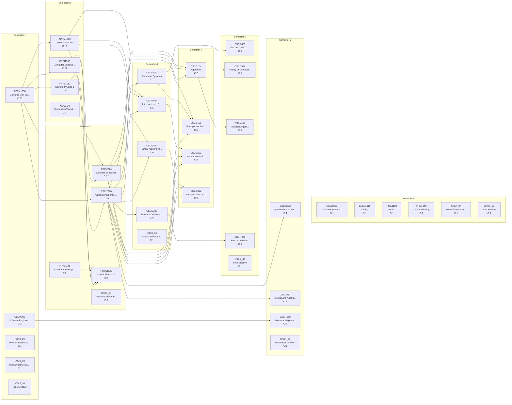

# Curriculum Report: Computer Science

## Overview

| Property | Value |
|----------|-------|
| **Institution** | University of Colorado Boulder |
| **Degree** | BS Computer Science |
| **System** | semester |
| **Years** | 4 |
| **CIP Code** | 11.07 |
| **Total Credits** | 128.0 |
| **Total Courses** | 38 |

## Complexity Metrics Summary

| Metric | Value | Details |
|--------|-------|---------|
| **Total Structural Complexity** | 193 | Sum of all course complexities |
| **Longest Delay** | 5 | Course: CSCI1300 |
| **Highest Centrality** | 98 | Course: CSCI2270 |

### Longest Delay Path (Critical Path)

APPM1350 → CSCI2824 → CSCI3104 → CSCI4114

---

## Term-by-Term Schedule

| Semester | Courses | Credits |
|---|---|---|
| 1 | APPM1350 - Calculus 1 for Engineers, CSCI4308 - Software Engineering Project 1, XXXX_26 - Humanities/Social Sciences, XXXX_28 - Humanities/Social Sciences, XXXX_38 - Free Elective | 18.0 |
| 2 | CSCI1300 - Computer Science 1: Starting Computing, APPM1360 - Calculus 2 for Engineers, PHYS1110 - General Physics 1, XXXX_30 - Humanities/Social Sciences | 15.0 |
| 3 | CSCI2270 - Computer Science 2: Data Structure, CSCI2824 - Discrete Structures, PHYS1120 - General Physics 2 (Science Elective), PHYS1140 - Experimental Physics 1 (Science Elective), XXXX_34 - Natural Science Elective | 16.0 |
| 4 | CSCI2400 - Computer Systems, CSCI3308 - Software Development Methods and Tools, CSCI2820 - Linear Algebra with Computer Science Applications, CSCI3022 - Introduction to Data Science with Probability and Statistics, XXXX_35 - Natural Science Elective | 17.0 |
| 5 | CSCI3104 - Algorithms, CSCI3155 - Principles of Programming Languages, CSCI3202 - Introduction to Artifical Intelligence (Computer Science Core Elective), CSCI3302 - Introduction to Robotics (Computer Science Core Elective) | 14.0 |
| 6 | CSCI3403 - Introduction to Cybersecuirty for a Converged World (Computer Science Core Elective), CSCI3434 - Theory of Computation (CS Elective), CSCI4114 - Practical Algorithm Complexity (CS Elective), CSCI4448 - Object Orinted Analysis and Design, XXXX_36 - Free Elective | 17.0 |
| 7 | CSCI3002 - Fundamentals of Human Computer Interaction (Computer Science Core Elective), CSCI3287 - Design and Analysis of Database Systems (Computer Science Core Elective), CSCI4318 - Software Engineering Project 2, XXXX_29 - Humanities/Social Sciences | 14.0 |
| 8 | CSCI1000 - Computer Science as a Field of Work and Study, ENES1010 - Writing, PHIL1100 - Ethics, PHIL1440 - Critical Thinking, XXXX_27 - Humanities/Social Sciences, XXXX_37 - Free Elective | 17.0 |

---

## Course Metrics

| Course | Name | Credits | Complexity | Blocking | Delay | Centrality |
|---|---|---|---|---|---|---|
| APPM1350 | Calculus 1 for Engineers | 4.0 | 25 | 20 | 5 | 0 |
| CSCI1300 | Computer Science 1: Starting Computing | 4.0 | 21 | 16 | 5 | 82 |
| CSCI2270 | Computer Science 2: Data Structure | 4.0 | 19 | 14 | 5 | 98 |
| APPM1360 | Calculus 2 for Engineers | 4.0 | 12 | 8 | 4 | 19 |
| CSCI2824 | Discrete Structures | 3.0 | 12 | 7 | 5 | 48 |
| CSCI2400 | Computer Systems | 4.0 | 7 | 2 | 5 | 18 |
| CSCI3104 | Algorithms | 4.0 | 7 | 2 | 5 | 44 |
| CSCI3308 | Software Development Methods and Tools | 3.0 | 6 | 1 | 5 | 9 |
| CSCI2820 | Linear Algebra with Computer Science Applications | 3.0 | 6 | 1 | 5 | 13 |
| CSCI3022 | Introduction to Data Science with Probability and Statistics | 3.0 | 6 | 1 | 5 | 22 |
| CSCI3155 | Principles of Programming Languages | 4.0 | 5 | 0 | 5 | 0 |
| CSCI3202 | Introduction to Artifical Intelligence (Computer Science Core Elective) | 3.0 | 5 | 0 | 5 | 0 |
| CSCI3302 | Introduction to Robotics (Computer Science Core Elective) | 3.0 | 5 | 0 | 5 | 0 |
| CSCI3403 | Introduction to Cybersecuirty for a Converged World (Computer Science Core Elective) | 4.0 | 5 | 0 | 5 | 0 |
| CSCI3434 | Theory of Computation (CS Elective) | 3.0 | 5 | 0 | 5 | 0 |
| CSCI4114 | Practical Algorithm Complexity (CS Elective) | 3.0 | 5 | 0 | 5 | 0 |
| CSCI4448 | Object Orinted Analysis and Design | 3.0 | 5 | 0 | 5 | 0 |
| CSCI3002 | Fundamentals of Human Computer Interaction (Computer Science Core Elective) | 4.0 | 4 | 0 | 4 | 0 |
| CSCI3287 | Design and Analysis of Database Systems (Computer Science Core Elective) | 3.0 | 4 | 0 | 4 | 0 |
| PHYS1110 | General Physics 1 | 4.0 | 4 | 1 | 3 | 3 |
| CSCI4308 | Software Engineering Project 1 | 4.0 | 3 | 1 | 2 | 0 |
| PHYS1120 | General Physics 2 (Science Elective) | 4.0 | 3 | 0 | 3 | 0 |
| PHYS1140 | Experimental Physics 1 (Science Elective) | 1.0 | 3 | 1 | 2 | 0 |
| CSCI4318 | Software Engineering Project 2 | 4.0 | 2 | 0 | 2 | 0 |
| CSCI1000 | Computer Science as a Field of Work and Study | 1.0 | 1 | 0 | 1 | 0 |
| PHIL1440 | Critical Thinking | 3.0 | 1 | 0 | 1 | 0 |
| PHIL1100 | Ethics | 3.0 | 1 | 0 | 1 | 0 |
| ENES1010 | Writing | 3.0 | 1 | 0 | 1 | 0 |
| XXXX_26 | Humanities/Social Sciences | 3.0 | 1 | 0 | 1 | 0 |
| XXXX_27 | Humanities/Social Sciences | 3.0 | 1 | 0 | 1 | 0 |
| XXXX_28 | Humanities/Social Sciences | 3.0 | 1 | 0 | 1 | 0 |
| XXXX_29 | Humanities/Social Sciences | 3.0 | 1 | 0 | 1 | 0 |
| XXXX_30 | Humanities/Social Sciences | 3.0 | 1 | 0 | 1 | 0 |
| XXXX_34 | Natural Science Elective | 4.0 | 1 | 0 | 1 | 0 |
| XXXX_35 | Natural Science Elective | 4.0 | 1 | 0 | 1 | 0 |
| XXXX_36 | Free Elective | 4.0 | 1 | 0 | 1 | 0 |
| XXXX_37 | Free Elective | 4.0 | 1 | 0 | 1 | 0 |
| XXXX_38 | Free Elective | 4.0 | 1 | 0 | 1 | 0 |

---

## Curriculum Graph

The following diagram shows the prerequisite relationships between courses.
- **Solid arrows** (→) indicate prerequisites
- **Dashed arrows** (⤍) indicate corequisites
- **C:N** indicates the complexity score

---

*Generated by NuAnalytics*
